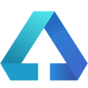
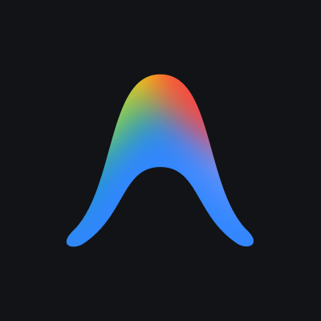
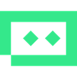

<div align="center">

# Coordy

### A local command center for coding agents

Plan work, delegate issues, coordinate agent teams, and follow every run from one desktop workspace.

[简体中文](README.zh-CN.md) · [Get started](#get-started) · [Features](#features) · [Development](#development)


</div>

Coordy brings your coding agents into one organized workspace. Create issues, assign the right agent, connect dependencies, automate recurring work, and see what is running without juggling terminals and disconnected chat sessions.

It works with coding-agent CLIs already installed and signed in on your computer. Your projects and execution history stay on your machine.

## Features

|                         | What you can do                                                                                                        |
| ----------------------- | ---------------------------------------------------------------------------------------------------------------------- |
| **Issues and projects** | Plan work on a board or list, add priorities, due dates, labels, attachments, subtasks, and project context.           |
| **Agent workspace**     | Create reusable agent profiles with instructions, models, skills, access rules, and concurrency limits.                |
| **Agent teams**         | Assign work to individual agents or squads, choose a conductor, and let ready tasks move through the dependency graph. |
| **Live execution**      | Follow runs, comments, retries, tool activity, inbox updates, and graph changes as they happen.                        |
| **Automations**         | Turn runbooks into scheduled or on-demand work using local agents.                                                     |
| **GitHub context**      | Sync pull requests, checks, and merge status through your local `gh` CLI.                                              |

## A typical workflow

1. Create a workspace for your repository.
2. Import a discovered coding CLI or create a specialized agent.
3. Break the goal into issues and connect their dependencies.
4. Assign agents or a squad and start the work.
5. Watch progress from the board, activity feed, or live graph.
6. Review the result, retry a failed run, or turn a repeatable process into an automation.

Coordy keeps task state separate from chat history, so the team can continue from the same plan even when individual agent sessions end.

## Get started

> [!NOTE]
> Coordy currently runs from source. You need Rust stable, Node.js 22, and pnpm 9.

```bash
git clone https://github.com/alexj11324/Coordy.git
cd Coordy
corepack enable
pnpm install
bash scripts/dev.sh
```

On first launch, Coordy starts its local daemon, creates a workspace, and discovers compatible CLIs on your `PATH`. Install at least one supported coding-agent CLI to run real work.

No agent CLI installed yet? Start the built-in ACP demo in another terminal:

```bash
cargo run -p coordy -- acp-stub
```

## Agent integrations

Coordy includes the full first-class Multica harness catalog, plus Gemini CLI. Each integration uses its real native or ACP protocol, and the model picker asks the installed harness for its current catalog whenever that harness supports discovery.

<table>
  <tr>
    <td align="center"><br>Claude Code</td><td align="center"><br>CodeBuddy</td><td align="center"><br>Codex</td><td align="center"><br>Copilot</td><td align="center"><br>OpenCode</td><td align="center"><br>DevEco</td>
  </tr><tr>
    <td align="center"><br>OpenClaw</td><td align="center"><br>Hermes</td><td align="center"><br>Pi</td><td align="center"><br>OMP</td><td align="center"><br>Cursor</td><td align="center"><br>Kimi</td>
  </tr><tr>
    <td align="center"><br>Reasonix</td><td align="center"><br>DSH</td><td align="center"><br>Kiro</td><td align="center"><br>Antigravity</td><td align="center"><br>Qoder</td><td align="center"><br>Qoder CN</td>
  </tr><tr>
    <td align="center"><br>TRAE</td><td align="center"><br>Grok</td><td align="center"><br>Qwen</td><td align="center"><br>QwenPaw</td><td align="center"><br>MCode</td><td align="center"><br>Gemini</td>
  </tr>
</table>

The Harness catalog marks a tool as **Installed** only after Coordy finds its executable on your `PATH`. Everything else is shown as **Not installed** and cannot be selected. Coordy never presents a Registry entry as if it were already installed.

## Local by design

```text
Electron app  →  secure preload  →  local IPC  →  coordyd  →  agent CLI
                                              ↘  SQLite
```

- `coordyd` owns workspace state and execution.
- The desktop connects through a user-scoped Unix socket or Windows named pipe.
- Workspace data and run history live in local SQLite.
- Provider sign-in and credentials stay with each coding-agent CLI; Coordy does not ask for a separate model API key.
- Private agent memory stays local and is excluded from shared sync data.

The optional `coordy-server` binary provides a shared control plane when you need one; a single-user desktop setup does not require it.

## Development

Start the full desktop stack:

```bash
pnpm install
bash scripts/dev.sh
```

Run the daemon and CLI separately:

```bash
cargo run -p coordyd
cargo run -p coordy -- health
cargo run -p coordy -- inspect
```

Run the main quality checks:

```bash
cargo fmt --all -- --check
cargo clippy --workspace --all-targets -- -D warnings
cargo run -p xtask -- verify-protocol
cargo test --workspace
pnpm --filter @coordy/desktop test
pnpm --filter @coordy/desktop typecheck
pnpm --filter @coordy/desktop build
```

> [!TIP]
> GitHub Actions are manual-only. Run the **CI** or **CD** workflow from the Actions tab when you want a remote build.

## Repository map

```text
apps/desktop/                 Electron + React desktop app
bins/coordyd/                 Local daemon
bins/coordy/                  Health, inspect, workspace, and ACP demo CLI
bins/coordy-server/           Optional shared control plane
crates/coordy-kernel/         Tasks, agents, permissions, graph, and scheduling
crates/coordy-harness/        CLI discovery and native process launch
crates/coordy-local-runtime/  SQLite, local IPC, secrets, and execution
crates/coordy-protocol/       Rust protocol source of truth
packages/protocol-ts/         Verified TypeScript protocol mirror
packages/ui/                  Shared UI components
docs/adr/                     Architecture decisions
research/s0-validation/       Archived task-drift research
```

See [`TODO.md`](TODO.md) for the product roadmap and [`docs/adr/`](docs/adr/) for the architectural decisions behind Coordy.
